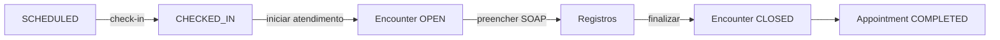

# MOA NEXUS - Arquitetura do Sistema

## Visão Geral

O MOA NEXUS é um sistema ERP multi-tenant para clínicas, construído com arquitetura modular e escalável usando NestJS, Prisma e PostgreSQL.

## Princípios Arquiteturais

### 1. Clean Architecture

- **Separação de Responsabilidades**: Cada camada tem responsabilidades bem definidas
- **Dependency Inversion**: Dependências apontam para abstrações
- **Modularidade**: Módulos independentes e reutilizáveis
- **Testabilidade**: Código facilmente testável por design

### 2. Domain-Driven Design (DDD)

- **Bounded Contexts**: Módulos representam contextos delimitados
- **Entities**: Modelos de domínio com identidade
- **Value Objects**: Objetos imutáveis sem identidade
- **Services**: Lógica de negócio complexa

## Camadas da Aplicação

```
┌─────────────────────────────────────────┐
│         Presentation Layer              │
│    (Controllers, DTOs, Guards)          │
└─────────────────────────────────────────┘
                  ↓
┌─────────────────────────────────────────┐
│         Application Layer               │
│    (Services, Use Cases)                │
└─────────────────────────────────────────┘
                  ↓
┌─────────────────────────────────────────┐
│         Domain Layer                    │
│    (Entities, Business Logic)           │
└─────────────────────────────────────────┘
                  ↓
┌─────────────────────────────────────────┐
│         Infrastructure Layer            │
│    (Prisma, Database, External APIs)    │
└─────────────────────────────────────────┘
```

## Estrutura de Módulos

### Core Modules (Infraestrutura)

#### 1. Auth Module
- **Responsabilidade**: Autenticação e autorização
- **Componentes**:
  - `AuthService`: Lógica de registro, login, validação
  - `AuthController`: Endpoints de autenticação
  - `JwtStrategy`: Estratégia Passport JWT
  - `JwtAuthGuard`: Proteção de rotas autenticadas

#### 2. RBAC Module
- **Responsabilidade**: Controle de acesso baseado em roles
- **Componentes**:
  - `PermissionsGuard`: Validação de permissões
  - `@Permissions`: Decorator para definir permissões
  - `permissions.ts`: Registro central de permissões

#### 3. Tenant Module
- **Responsabilidade**: Contexto multi-tenant
- **Componentes**:
  - `TenantService`: Resolução e validação de tenant
  - `TenantGuard`: Validação de acesso e injeção de contexto
- **Decisão Arquitetural**:
  - Guard ao invés de Middleware para garantir execução APÓS autenticação
  - Tenant resolution depende de `req.user` (populado por JwtAuthGuard)
  - Middleware executaria antes dos guards, sem acesso a `req.user`

#### 4. Prisma Module
- **Responsabilidade**: Acesso ao banco de dados
- **Componentes**:
  - `PrismaService`: Cliente Prisma com lifecycle hooks
  - Global module para injeção em toda aplicação

#### 5. Audit Module
- **Responsabilidade**: Auditoria automática de ações
- **Componentes**:
  - `AuditService`: Persistência de logs de auditoria
  - `AuditInterceptor`: Interceptor global HTTP
  - `AuditController`: Endpoint de consulta de logs
- **Características**:
  - Automático (não requer modificação de controllers)
  - Resiliente (não quebra aplicação se falhar)
  - Sem dados sensíveis
  - Compliance LGPD/GDPR

### Business Modules

#### 1. Clinics Module
- **Responsabilidade**: Gerenciamento de clínicas
- **Funcionalidades**:
  - Criação de clínicas
  - Listagem de clínicas do usuário
  - Validação de acesso
  - Contexto de tenant

#### 4. Professionals Module (Admin v1 - CRUD Complete)

**Objective**: Provide complete admin management for clinic professionals

**Architecture Pattern**: Explicit Multi-Tenancy + Soft Delete

**Key Principles**:
- TenantGuard is mandatory (no implicit clinic resolution)
- Role filtering at query level (PROFESSIONAL only)
- DTO pattern for future extensibility
- Administrative endpoints (RBAC-ready)
- Soft delete over physical delete
- Self-removal protection

**Endpoints**:
- `GET /professionals` - List active professionals
- `POST /professionals` - Create professional (HTTP 201)
- `PATCH /professionals/:userId/activate` - Activate
- `PATCH /professionals/:userId/deactivate` - Deactivate
- `DELETE /professionals/:userId` - Soft delete

**Guards**:
- `JwtAuthGuard` - Authentication required
- `TenantGuard` - X-Clinic-Id header required
- `PermissionsGuard` - Commented out, ready for RBAC v2

**Service Logic**:
```typescript
// List - only active professionals
where: {
  clinicId,
  role: { key: 'PROFESSIONAL' },
  active: true
}

// Create - validates and prevents duplicates
- Check user exists
- Check not already in clinic (409 if duplicate)
- Enforce PROFESSIONAL role
- Create with active=true

// Soft Delete - preserves history
await prisma.clinicUser.update({
  where: { id },
  data: { active: false }
})

// Self-removal protection
if (userId === currentUserId) {
  throw ForbiddenException
}
```

**Schema Changes**:
```prisma
model ClinicUser {
  active    Boolean  @default(true)
  updatedAt DateTime @default(now()) @updatedAt
}
```

**Why This Matters**:
- Prevents returning admins/receptionists in professional selects
- Establishes correct multi-tenant pattern for future modules
- Soft delete preserves appointment/encounter history
- Self-removal protection prevents admin lockout
- Foundation for admin UI and RBAC expansion
- Replaces architectural workaround (/clinics/users)

**Design Decisions**:
1. **Soft Delete**: Sets `active=false` instead of physical deletion
   - Preserves historical data
   - Allows reactivation
   - Prevents broken references
2. **Self-Removal Protection**: Prevents admins from removing themselves
   - Avoids admin lockout scenarios
   - Forces deliberate admin transfer
3. **Consistent Naming**: Uses `userId` (not `professionalId`)
   - Matches database schema
   - Avoids confusion with ClinicUser.id

**Future Enhancements**:
- Specialty filtering
- Availability management
- Professional-specific settings
- Color coding for calendar
- Working hours configuration

---

#### 5. RBAC (Role-Based Access Control) v1

**Objective**: Enforce runtime permission checks on administrative endpoints

**Architecture Pattern**: Guard-Based Permission Enforcement

**Key Principles**:
- Permissions enforced at runtime (not just documentation)
- Tenant-aware permission checks
- Static role-permission mappings (seeded)
- Guard-based enforcement (NestJS idiomatic)
- Explicit over implicit

**Schema**:
```prisma
model Permission {
  id          String   @id @default(uuid())
  key         String   @unique
  description String
  rolePermissions RolePermission[]
}

model RolePermission {
  roleId       String
  permissionId String
  role         Role       @relation(...)
  permission   Permission @relation(...)
  @@unique([roleId, permissionId])
}
```

**Core Components**:

1. **PERMISSIONS Constants** (`src/core/rbac/permissions.ts`):
   - 37 permissions across 9 modules
   - Type-safe permission keys
   - Organized by module (Clinic, Appointments, Encounters, etc.)

2. **@Permissions Decorator** (`src/core/rbac/decorators/permissions.decorator.ts`):
   - Declares required permissions for routes
   - Uses SetMetadata to attach permissions to route handler

3. **PermissionsGuard** (`src/core/rbac/guards/permissions.guard.ts`):
   - Executes after JwtAuthGuard and TenantGuard
   - Fetches user's ClinicUser record for current clinic
   - Loads role's permissions via RolePermission
   - Checks if user has ALL required permissions (AND logic)
   - Throws 403 if missing permissions

**Guard Execution Flow**:
```typescript
1. JwtAuthGuard → Authenticates user (req.user)
2. TenantGuard → Validates clinic access (req.clinicId)
3. PermissionsGuard → Checks permissions
   - Extract required permissions from @Permissions decorator
   - Fetch ClinicUser where { userId, clinicId, active: true }
   - Load role.rolePermissions.permission
   - Verify user has ALL required permissions
   - Allow or throw ForbiddenException
```

**Permission Logic**:
```typescript
// AND logic - user must have ALL permissions
const hasAllPermissions = requiredPermissions.every(permission =>
  userPermissions.includes(permission)
);
```

**Role-Permission Mappings** (Seeded):
```typescript
ADMIN:
  - CLINIC_ADMIN
  - PROFESSIONAL_READ
  - PROFESSIONAL_MANAGE

CLINIC_ADMIN:
  - CLINIC_ADMIN
  - PROFESSIONAL_READ
  - PROFESSIONAL_MANAGE

PROFESSIONAL:
  - PROFESSIONAL_READ
  - (+ clinical operation permissions)

RECEPTIONIST:
  - PROFESSIONAL_READ
  - (+ scheduling permissions)
```

**Usage Example**:
```typescript
@Controller('professionals')
@UseGuards(JwtAuthGuard, TenantGuard, PermissionsGuard)
export class ProfessionalsController {
  
  @Get()
  @Permissions(PERMISSIONS.PROFESSIONAL_READ)
  async getProfessionals() { }
  
  @Post()
  @Permissions(PERMISSIONS.PROFESSIONAL_MANAGE)
  async createProfessional() { }
}
```

**Error Responses**:
- **403 Forbidden** - Missing permission
  ```json
  {
    "message": "You do not have permission to perform this action",
    "error": "Forbidden",
    "statusCode": 403
  }
  ```
- **403 Forbidden** - No role in clinic
  ```json
  {
    "message": "User has no role in this clinic",
    "error": "Forbidden",
    "statusCode": 403
  }
  ```

**Why This Matters**:
- Security enforced at runtime, not just documentation
- Tenant-aware (permissions checked per clinic)
- Prevents unauthorized access to admin endpoints
- Clean separation of concerns (guards enforce, decorators declare)
- Foundation for future permission management UI

**Design Decisions**:
1. **Static Permissions (v1)**: Permissions seeded, not editable via UI
   - Simpler implementation
   - Sufficient for initial rollout
   - UI can be added in v2
2. **AND Logic**: User must have ALL required permissions
   - More restrictive, more secure
   - Clear permission requirements
3. **Active User Filtering**: Only active ClinicUser records checked
   - Respects soft delete pattern
   - Prevents deactivated users from accessing resources

**Current Status**:
- ✅ Enabled on all protected controllers
- ✅ 40+ permissions defined (including audit.read)
- ✅ 4 roles with mappings seeded
- ✅ Integrated with Audit Log v1

**Future Enhancements**:
- Permission management UI
- Dynamic role creation
- Fine-grained permissions per resource
- Permission caching for performance

---

#### 6. Audit Log v1

**Objective**: Track administrative actions with immutable, tenant-scoped logs

**Architecture Pattern**: Service-Level Explicit Logging

**Key Principles**:
- Server-side logging only (not frontend)
- Tenant-scoped (clinicId required)
- Immutable entries (no edit/delete)
- Explicit logging calls (no interceptors v1)
- Read-only UI

**Schema**:
```prisma
model AuditLog {
  id         String      @id @default(uuid())
  clinicId   String?
  userId     String?
  action     AuditAction // enum: CREATE, UPDATE, DELETE, VIEW, LOGIN, EXPORT
  entity     String
  entityId   String?
  message    String?
  ip         String?
  userAgent  String?
  createdAt  DateTime    @default(now())

  clinic Clinic? @relation(...)
  user   User?   @relation(...)

  @@index([clinicId, createdAt])
  @@index([userId, createdAt])
}
```

**Core Components**:

1. **AuditService** (`src/core/audit/audit.service.ts`):
   ```typescript
   @Injectable()
   export class AuditService {
     async log(data: {
       clinicId: string;
       userId?: string;
       action: AuditAction;
       entity: string;
       entityId?: string;
       message?: string;
     }): Promise<void>
     
     async findAll(clinicId: string, filters?: {...}): Promise<AuditLog[]>
   }
   ```

2. **AuditController** (`src/core/audit/audit.controller.ts`):
   ```typescript
   @Controller('audit-logs')
   @UseGuards(JwtAuthGuard, TenantGuard, PermissionsGuard)
   export class AuditController {
     @Get()
     @Permissions(PERMISSIONS.AUDIT_READ)
     async findAll(@Query() query, @Request() req) { }
   }
   ```

**Integration Example** (ProfessionalsService):
```typescript
async activateProfessional(clinicId: string, userId: string, currentUserId: string) {
  // ... business logic ...
  
  await this.auditService.log({
    clinicId,
    userId: currentUserId,
    action: AuditAction.UPDATE,
    entity: 'Professional',
    entityId: userId,
    message: 'Professional activated',
  });
}
```

**API Endpoint**:
- **GET /audit-logs** - List logs (tenant-scoped)
  - Query params: action, entity, dateFrom, dateTo
  - Permission: audit.read
  - Returns: `{ data: AuditLog[], count: number }`

**Frontend Components**:
- **Route**: `/dashboard/admin/auditoria`
- **Components**:
  - AuditLogAdminPage
  - AuditLogTable
  - AuditActionBadge
- **Hook**: useAuditLogs

**RBAC**:
- Permission: `audit.read`
- Assigned to: CLINIC_ADMIN

**Design Decisions**:
1. **Explicit Logging (v1)**: Called in service methods, not interceptors
   - More control over what is logged
   - Avoids noise from read operations
   - Clear audit trail
2. **Read-Only UI**: No editing or deleting logs
   - Maintains integrity
   - Compliance-friendly
3. **Tenant-Scoped**: Each clinic sees only their logs
   - Multi-tenant isolation preserved

**Current Status** (v2):
- ✅ Logs created on professional activate/deactivate
- ✅ Logs created on appointment create/check-in/cancel
- ✅ Logs created on encounter start/close
- ✅ Logs created on stock product create/delete
- ✅ Logs created on stock movement add
- ✅ Read-only UI at /dashboard/admin/auditoria
- ✅ RBAC enforced with audit.read
- ✅ Portuguese translations for all actions

**Action Messages** (dot.case pattern):
- `appointment.created` / `appointment.checked_in` / `appointment.cancelled`
- `encounter.started` / `encounter.closed`
- `stock.product.created` / `stock.product.deleted: <name>`
- `stock.movement.created`

**Future Enhancements** (v3):
- Include entity name in all action messages
- Real-time updates
- Export to CSV
- Pagination
- Date range filtering in UI

---

#### 7. Stock Module (v1)
- **Responsabilidade**: Gestão de estoque com controle de lotes
- **Arquitetura**:
  - **Product**: Cadastro de produtos (nome, descrição, unidade, SKU, estoque mínimo)
  - **StockLot**: Lotes com quantidade e validade (FIFO automático)
  - **StockMovement**: Histórico de movimentações (IN/OUT)
- **Funcionalidades Backend**:
  - CRUD de produtos (soft delete)
  - Entrada de estoque (cria lote)
  - Saída de estoque (FIFO por validade)
  - Alertas de estoque baixo
  - Alertas de produtos próximos ao vencimento
  - Auditoria integrada
- **Frontend Pages**:
  | Route | Descrição |
  |-------|-----------|
  | `/dashboard/estoque` | Visão do estoque atual + alertas |
  | `/dashboard/estoque/produtos` | Cadastro CRUD de produtos |
  | `/dashboard/estoque/movimentacoes` | Histórico (placeholder v2) |
- **Estoque Page Features**:
  - Summary cards: Total produtos | Estoque baixo | Sem estoque
  - Tabela: Produto | SKU | Qtd Atual | Qtd Mínima | Status
  - Status badges: ✅ OK | ⚠️ Estoque Baixo | 🔴 Sem Estoque
  - Busca e filtros por status
- **Produtos Page Features**:
  - Colunas: Nome | Descrição | Unidade | SKU | Qtd Mínima | Ações
  - Busca por nome/SKU
  - CRUD completo
- **Audit Logs**: product.created, product.deleted, movement.created

---

### Frontend Integration Layer

#### Integration v1 - Cross-Module Consistency
- **Objetivo**: Substituir inputs manuais de UUID por selects relacionais
- **Componentes**:
  - `usePatients` hook - Fetch centralizado de pacientes
  - `useProfessionals` hook - Fetch centralizado de profissionais
- **Módulos Integrados**:
  - Agenda: Create/Edit dialogs com select de paciente/profissional
  - Encounters: Create/Edit dialogs com select de paciente/profissional
- **Benefícios**:
  - Melhor UX (nomes ao invés de UUIDs)
  - Integridade de dados
  - Módulos conectados
- **Limitações**:
  - Endpoint de profissionais não implementado (retorna array vazio)

---

### Domain Flow v1 - Agenda → Encounters Integration

#### Objetivo
Implementar o primeiro fluxo clínico real conectando Agenda com Encounters, permitindo iniciar atendimentos a partir de agendamentos com validação de workflow.

#### Schema Changes (2025-12-18)

**Problema Encontrado**:
Durante a implementação, tentamos usar campos separados (`date`, `startAt`, `endAt`) como strings no modelo Appointment, mas isso causou:
- Breaking changes no frontend existente
- Complexidade na validação de conflitos  
- Incompatibilidade com código existente

**Solução Aplicada**:
Revertemos para usar `DateTime` no Appointment e manter strings apenas no Encounter:
- **Appointment**: `startAt` e `endAt` como `DateTime` (ISO strings)
- **Encounter**: `date` (YYYY-MM-DD) e `time` (HH:MM) como strings
- Frontend atualizado para combinar/parsear DateTime conforme necessário

**Migrations**:
1. `20251219020200_add_appointment_id_to_encounter` - Adiciona `appointmentId` ao Encounter
2. `20251219023915_revert_appointment_to_datetime` - Reverte Appointment para DateTime

#### Backend Implementation

**Novo Endpoint**:
```typescript
POST /appointments/:id/start-encounter
Body: { notes?: string }
Permission: ENCOUNTER_START
```

**Validações**:
- Appointment deve existir e pertencer à clínica
- Status deve ser SCHEDULED ou CHECKED_IN
- Não pode haver encounter ativo para o mesmo appointment
- Paciente e profissional herdados automaticamente

**Extração de Data/Hora**:
```typescript
date: appointment.startAt.toISOString().split('T')[0]  // "2025-12-18"
time: appointment.startAt.toISOString().split('T')[1].substring(0, 5)  // "14:30"
```

#### Frontend Updates

**Dialogs Atualizados**:
- Create/Edit Appointment: Combinam date+time → ISO DateTime antes de enviar
- Parse DateTime → date+time para exibição nos formulários
- Lista de Agenda: Formata DateTime para exibição (HH:MM)

**Fluxo de Dados**:
```
User Input: date="2025-12-18", startAt="14:30", endAt="15:30"
     ↓
API Send: startAt="2025-12-18T14:30:00.000Z", endAt="2025-12-18T15:30:00.000Z"
     ↓
Display: "14:30 - 15:30"
```

**Workflow Rules**:
- ✅ Statuses permitidos: SCHEDULED, CHECKED_IN
- ❌ Statuses bloqueados: CANCELLED, NO_SHOW, COMPLETED
- Um encounter por appointment (máximo)
- Dados herdados automaticamente (sem override manual)

#### Testing Results (2025-12-19)

**Tested Successfully**:
- ✅ Criar agendamento com date+time → ISO DateTime
- ✅ Agendamento aparece na lista de Agenda
- ✅ Botão "Iniciar Atendimento" visível
- ✅ Clicar no botão cria encounter automaticamente
- ✅ Encounter herda paciente, profissional, data, hora
- ✅ Redirect para /dashboard/atendimentos
- ✅ Encounter aparece na lista de Atendimentos

**Known Issues**:
- Botão "Iniciar Atendimento" não desaparece após criar encounter (requer reload)
- Flag `hasActiveEncounter` não implementada no backend
- Filtro de data corrigido (startAt entre início e fim do dia)

**Additional Fixes**:
- GET /clinics/users endpoint criado para listar profissionais
- useProfessionals hook atualizado para usar novo endpoint
- Appointment date filter fixed (was excluding appointments)

---

#### 2.5 Patients Module (v2)
- **Responsabilidade**: Prontuário clínico do paciente
- **Backend Endpoints**:
  | Method | Path | Description |
  |--------|------|-------------|
  | GET | `/patients/:id/timeline` | Histórico de appointments + encounters |
  | GET | `/patients/:id/summary` | Contagens e última visita |
- **Frontend (v2)**:
  | Route | Descrição |
  |-------|-----------|
  | `/dashboard/pacientes` | Lista com Ver/Editar/Excluir |
  | `/dashboard/pacientes/:id` | Prontuário com timeline clínica |
- **Detail Page Features**:
  - Header: nome, CPF, nascimento, idade, contato
  - Summary cards: Agendamentos | Atendimentos | Em Aberto | Última Visita
  - Timeline clínica: cronológica, clicável
  - Navegação: appointment → agenda, encounter → /atendimentos/:id

#### 3. Encounters Module (v5)
- **Responsabilidade**: Gestão de atendimentos clínicos
- **Funcionalidades**:
  - Iniciar atendimento a partir de agendamento
  - **Notas Clínicas SOAP**: Subjetivo, Objetivo, Avaliação, Plano
  - **Anexos Clínicos**: Upload PDF/imagens
  - **Relatório PDF**: Geração on-demand com SOAP, procedimentos, anexos
  - Timeline de eventos (start, records, procedures, consumables, close)
  - Fechar atendimento (imutabilidade garantida)
- **SOAP Endpoints**:
  | Method | Path | Description |
  |--------|------|-------------|
  | GET | `/encounters/:id/note` | Busca nota SOAP |
  | POST | `/encounters/:id/note` | Cria nota (OPEN only) |
  | PUT | `/encounters/:id/note` | Atualiza nota (OPEN only) |
- **Attachments Endpoints**:
  | Method | Path | Description |
  |--------|------|-------------|
  | GET | `/encounters/:id/attachments` | Lista anexos |
  | POST | `/encounters/:id/attachments` | Upload (OPEN only) |
  | GET | `/encounters/:id/attachments/:id` | Download |
- **Report Endpoint**:
  | Method | Path | Description |
  |--------|------|-------------|
  | GET | `/encounters/:id/report` | Gera PDF (CLOSED only) |
- **Storage**: `./uploads/clinics/{clinicId}/encounters/{encounterId}/`
- **Limites**: 10MB max | PDF, JPG, PNG
- **Regras de Negócio**:
  - SOAP/anexos só podem ser criados em atendimento OPEN
  - Relatório só pode ser gerado quando CLOSED
  - Read-only após CLOSED
  - Audit log automático

#### 4. Scheduling Module (v5)
- **Responsabilidade**: Calendário profissional e agendamentos
- **Modelo ScheduleBlock**:
  - `professionalId?`: null = clínica inteira
  - `date`: YYYY-MM-DD
  - `startTime?/endTime?`: null = dia inteiro
  - `reason`: motivo do bloqueio
- **Frontend Views**:
  - **Visão Mensal** (`/dashboard/agenda`): Calendário com indicadores de agendamentos por dia
  - **Vista do Dia** (`/dashboard/agenda/[date]`): Grid profissionais × horários (30min slots)
- **Funcionalidades**:
  - CRUD completo de agendamentos
  - Detecção de conflitos de horário
  - Check-in de pacientes (via modal no calendário)
  - Cancelamento de agendamentos
  - Criação de bloqueios (dia inteiro ou horário específico)
  - Status flow (SCHEDULED → CHECKED_IN → IN_PROGRESS → COMPLETED)
  - Modal de detalhes com ações (Check-in, Iniciar Atendimento, Cancelar)
  - Navegação inteligente (volta para origem correta)
  - Tooltip com motivo do bloqueio
  - Horário de funcionamento configurável por dia da semana
  - Visualização de dias fechados no calendário mensal
- **Modelo ClinicWorkingHours**:
  - `dayOfWeek`: 0-6 (Dom-Sáb)
  - `isOpen`: boolean
  - `startTime/endTime`: "HH:MM" (se aberto)
- **Validations (v5)**:
  - `validateConflict()`: Previne agendamentos sobrepostos (409 Conflict)
  - `validateScheduleBlock()`: Respeita bloqueios (403 Forbidden)
  - `isOutsideWorkingHours()`: Respeita horário de funcionamento (403 Forbidden)
  - Status flow validation: checkIn e cancel validam transições
  - Encounter uniqueness: Um encounter ativo por agendamento
- **Endpoints**:
  - `GET /appointments`: listar agendamentos
  - `GET /appointments/professionals`: listar profissionais
  - `GET /appointments/blocks`: listar bloqueios
  - `POST /appointments/blocks`: criar bloqueio
  - `DELETE /appointments/blocks/:id`: remover bloqueio
  - `GET /appointments/working-hours`: obter horário de funcionamento
  - `PUT /appointments/working-hours`: atualizar horário de funcionamento
  - `POST /appointments/:id/checkin`: fazer check-in
  - `POST /appointments/:id/start-encounter`: iniciar atendimento
- **Config UI** (`/dashboard/agenda/configuracoes`):
  - Listar e remover bloqueios
  - Configurar horário de funcionamento por dia da semana
  - Toggle aberto/fechado + seleção de horário

#### 5. History Module
- **Responsabilidade**: Histórico de atendimentos por paciente
- **Frontend**: `/dashboard/atendimentos/historico`
- **Funcionalidades**:
  - Lista de pacientes com busca
  - Seleção de paciente → lista de atendimentos
  - Clique em atendimento → detalhes com navegação inteligente
  - Rastreamento de origem via query param (?from=historico)
- **Separação de Módulos**:
  - **Pacientes** (Recepção): apenas cadastro
  - **Histórico** (Atendimento): visualização de prontuário

#### 6. Agenda↔Encounter Integration Flow

- **Sincronização automática** de status entre módulos
- **Timezone handling** corrigido (datas em fuso local)
- **Validações**:
  - Não permite iniciar se já existe encounter ativo
  - Não permite iniciar se appointment CANCELLED/COMPLETED
- **Detail Page Features**:
  - Header com paciente, profissional, status
  - Summary cards (registros, procedimentos, consumíveis)
  - Timeline cronológica visual (start → records → procedures → consumables → close)
  - Botão "Finalizar Atendimento"
  - Ações desabilitadas quando CLOSED
- **Status Badges**: 🟢 Em Andamento | 🔵 Finalizado

#### 5. Encounter Items Module
- **Responsabilidade**: Procedimentos e consumíveis
- **Funcionalidades**:
  - Registro de procedimentos realizados
  - Registro de consumíveis utilizados
  - Snapshot de preço
  - Quantidade e unidade flexíveis
  - Imutabilidade após fechamento (ForbiddenException)

#### 6. Health Module
- **Responsabilidade**: Health checks
- **Funcionalidades**:
  - Status da API
  - Verificação de conectividade

#### 7. Stock Module
- **Responsabilidade**: Gestão de estoque
- **Funcionalidades**:
  - CRUD de produtos com soft delete
  - Controle de lotes com validade
  - Movimentações (IN/OUT/ADJUST)
  - Saída FIFO por data de validade
  - Alertas de estoque baixo
  - Alertas de lotes vencendo
  - Histórico completo de movimentações
  - **Integração automática com ConsumableUsage**
  - **Frontend**: Módulo completo com create, edit, delete e controle de quantidade

## Fluxo de Request

### 1. Request Básico (Sem Autenticação)

```
HTTP Request
    ↓
Middleware Stack
    ↓
Controller
    ↓
Service
    ↓
Prisma/Database
    ↓
Response
```

### 2. Request Autenticado com Multi-Tenancy

```
HTTP Request (com header X-Clinic-Id)
    ↓
JwtAuthGuard (valida token)
    ↓
req.user = { id, email }
    ↓
TenantGuard (resolve clinicId, valida acesso)
    ↓
req.clinicId = "uuid"
    ↓
Controller
    ↓
Service (usa req.user e req.clinicId)
    ↓
Prisma (filtra por clinicId)
    ↓
Response
```

### 3. Request com RBAC (Fluxo Completo)

```
HTTP Request (com Authorization + X-Clinic-Id)
    ↓
JwtAuthGuard (valida token, popula req.user)
    ↓
TenantGuard (resolve clinicId, valida acesso, popula req.clinicId)
    ↓
PermissionsGuard (valida permissões)
    ↓
  - Busca ClinicUser por (userId, clinicId)
  - Carrega Role → Permissions
  - Valida se tem permissões requeridas
    ↓
Controller (se autorizado)
    ↓
Service
    ↓
Response
```

**Ordem de Execução Crítica:**
1. **JwtAuthGuard** DEVE executar primeiro (popula `req.user`)
2. **TenantGuard** executa segundo (precisa de `req.user` para validar acesso)
3. **PermissionsGuard** executa terceiro (precisa de `req.user` e `req.clinicId`)

## Multi-Tenancy

### Estratégia: Row-Level Tenancy

Cada registro pertence a uma clínica específica através de `clinicId`.

#### Vantagens
- ✅ Simplicidade de implementação
- ✅ Custo-efetivo (um banco para todos)
- ✅ Fácil manutenção
- ✅ Backup e restore simplificados

#### Isolamento de Dados

```typescript
// Exemplo: Buscar pacientes da clínica atual
async findAll(clinicId: string) {
  return this.prisma.patient.findMany({
    where: { clinicId }, // Filtro automático por tenant
  });
}
```

### Resolução de Tenant

1. **Header X-Clinic-Id**: Cliente envia ID da clínica (método primário)
2. **JWT Payload**: `clinicId` pode estar no token (fallback)
3. **Validação**: TenantGuard valida se usuário pertence à clínica
4. **Injeção**: Guard injeta `clinicId` em `req.clinicId` para uso nos services

## RBAC (Role-Based Access Control)

### Modelo de Permissões

```
User → ClinicUser → Role → RolePermission → Permission
```

### Hierarquia de Roles

```
CLINIC_ADMIN (todas as permissões)
    ↓
RECEPTION (pacientes + agendamentos)
    ↓
PROFESSIONAL (atendimentos + prontuários)
    ↓
FINANCE (financeiro)
    ↓
STOCK (estoque)
```

### Validação de Permissões

```typescript
@Get('patients')
@UseGuards(JwtAuthGuard, PermissionsGuard)
@Permissions(PERMISSIONS.PATIENT_READ)
async list(@Request() req) {
  // PermissionsGuard já validou que:
  // 1. Usuário está autenticado
  // 2. Usuário pertence à clínica
  // 3. Role do usuário tem permissão PATIENT_READ
  
  return this.service.findAll(req.clinicId);
}
```

## Segurança

### 1. Autenticação

- **JWT**: Tokens stateless com expiração
- **Bcrypt**: Hash de senhas com 10 salt rounds
- **Passport**: Estratégias de autenticação

### 2. Autorização

- **Guards**: Validação em múltiplas camadas
- **RBAC**: Permissões granulares por role
- **Tenant Isolation**: Validação de acesso por clínica

### 3. Validação

- **DTOs**: Validação automática com class-validator
- **Pipes**: Transformação e validação de dados
- **Whitelist**: Remoção de campos não permitidos

### 4. Database

- **Prisma**: Proteção contra SQL injection
- **Transactions**: Operações atômicas
- **Soft Delete**: Preservação de dados

## Padrões de Design

### 1. Dependency Injection

```typescript
@Injectable()
export class PatientsService {
  constructor(
    private prisma: PrismaService,
    private tenantService: TenantService,
  ) {}
}
```

### 2. Repository Pattern

```typescript
// Prisma atua como repository
async findAll(clinicId: string) {
  return this.prisma.patient.findMany({
    where: { clinicId },
  });
}
```

### 3. Guard Pattern

```typescript
// Ordem CRÍTICA: JwtAuthGuard → TenantGuard → PermissionsGuard
@UseGuards(JwtAuthGuard, TenantGuard, PermissionsGuard)
```

**Por que Guards e não Middleware?**
- Guards executam APÓS middleware, com acesso a `req.user`
- Guards podem ser aplicados seletivamente por rota
- Guards têm melhor integração com ExecutionContext
- Tenant validation PRECISA de `req.user` (populado por JwtAuthGuard)

### 4. Decorator Pattern

```typescript
@Permissions(PERMISSIONS.PATIENT_CREATE)
```

## Escalabilidade

### Horizontal Scaling

- ✅ Stateless (JWT)
- ✅ Load balancer ready
- ✅ Shared database (com connection pooling)

### Vertical Scaling

- ✅ Prisma connection pooling
- ✅ Query optimization
- ✅ Indexes no banco

### Caching (Futuro)

- Redis para sessões
- Cache de permissões
- Cache de queries frequentes

## Monitoramento e Observabilidade

### Logs

- Structured logging (JSON)
- Níveis: error, warn, log, debug
- Contexto: userId, clinicId, requestId

### Métricas (Futuro)

- Request duration
- Error rates
- Database query performance
- Active users per clinic

### Health Checks

- `/health`: Status da API
- Database connectivity
- External services

## Testes

### Estratégia de Testes

```
Unit Tests (70%)
    ↓
Integration Tests (20%)
    ↓
E2E Tests (10%)
```

### Cobertura

- Services: Lógica de negócio
- Guards: Validações de acesso
- Controllers: Endpoints
- E2E: Fluxos completos

## Deployment

### Ambientes

- **Development**: Local com hot reload
- **Staging**: Ambiente de testes
- **Production**: Ambiente de produção

### CI/CD (Futuro)

```
Git Push
    ↓
Run Tests
    ↓
Build Docker Image
    ↓
Deploy to Staging
    ↓
Manual Approval
    ↓
Deploy to Production
```

## Tecnologias e Ferramentas

### Backend
- NestJS 10.x
- TypeScript 5.x
- Prisma 5.x
- PostgreSQL 15+

### Autenticação
- Passport JWT
- Bcrypt

### Validação
- class-validator
- class-transformer

### Desenvolvimento
- ESLint
- Prettier
- ts-node

## Decisões Arquiteturais

### Por que TenantGuard ao invés de TenantMiddleware?

**Problema com Middleware:**
- Middleware executa ANTES de guards no pipeline do NestJS
- JwtAuthGuard popula `req.user`, mas executa DEPOIS do middleware
- TenantMiddleware não tinha acesso a `req.user` para validar acesso

**Solução com Guard:**
- TenantGuard executa APÓS JwtAuthGuard
- `req.user` já existe quando guard valida acesso à clínica
- Melhor separação de responsabilidades
- Alinhado com best practices do NestJS

**Request Pipeline:**
```
Middleware → Guards → Interceptors → Controller
             ↑
             TenantGuard executa aqui (req.user disponível)
```

---

**Última atualização**: 2025-12-18
